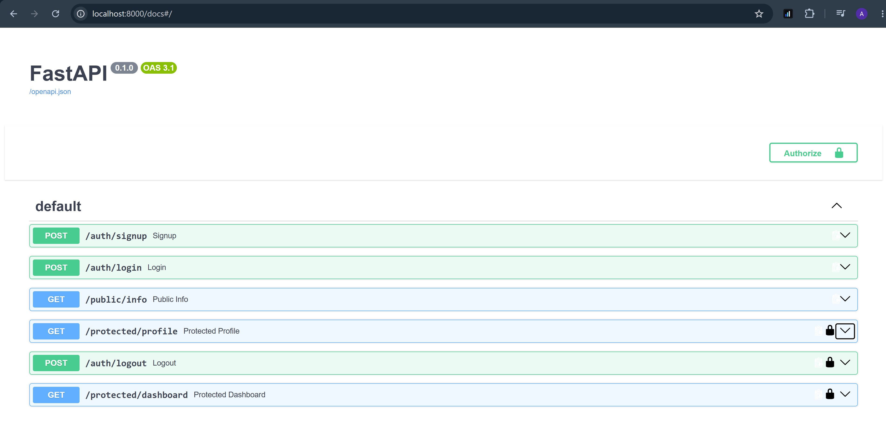

# Auth API — Login & Protect

A secure FastAPI backend that handles user **signup, login, and logout**, and protects specific routes using **Supabase Auth** and **JWT Bearer tokens**. Built as part of the FlyRank Backend AI Engineering internship (Week 4 — Assignment BE-03).

## What This Is

This project demonstrates a real authentication flow between three parties: the **client**, this **backend server**, and **Supabase** as the Identity Provider.

- Users sign up and log in with an email/password, handled entirely by Supabase (no passwords or cryptography handled by this server directly).
- On successful login, Supabase returns a **JWT access token**.
- The client attaches this token to protected requests via the `Authorization: Bearer <token>` header.
- The server verifies the token with Supabase before granting access to protected routes.

## How to Set Up Environment Variables

1. Create a free project at [supabase.com](https://supabase.com).
2. In your Supabase Dashboard, go to **Project Settings → API** and copy your **Project URL** and **anon public key**.
3. Create a `.env` file in the project root (this file is gitignored and must never be committed):

   ```
   SUPABASE_URL=your_project_url
   SUPABASE_KEY=your_anon_key
   PORT=8000
   ```

4. A `.env.example` file is included in this repo showing the required format without real values — copy it to `.env` and fill in your own keys.

**Note:** For local testing convenience, email confirmation was disabled in the Supabase Dashboard under **Authentication → Providers → Email**, so newly signed-up users can log in immediately without clicking a confirmation link.

## How to Install & Run

**Requirements:** Python 3.10+

1. Clone this repository:
   ```bash
   git clone https://github.com/YOUR_USERNAME/YOUR_REPO_NAME.git
   cd YOUR_REPO_NAME
   ```

2. Create a virtual environment and install dependencies:
   ```bash
   uv venv
   .venv\Scripts\activate
   uv pip install fastapi uvicorn supabase python-dotenv
   ```
   *(or, without `uv`: `pip install fastapi uvicorn supabase python-dotenv`)*

3. Set up your `.env` file as described above.

4. Run the server:
   ```bash
   python main.py
   ```

5. The API runs at `http://127.0.0.1:8000`, with interactive Swagger docs at `http://127.0.0.1:8000/docs`.

## API Reference

| Method | Path                     | Description                          | Requires Auth? | Success Status | Error Status |
|--------|--------------------------|----------------------------------------|:--------------:|-----------------|--------------|
| POST   | `/auth/signup`           | Create a new user account              | No             | 201             | 400          |
| POST   | `/auth/login`            | Authenticate and receive a JWT         | No             | 200             | 400, 401     |
| POST   | `/auth/logout`           | Sign out the current session           | **Yes**        | 204             | 401          |
| GET    | `/public/info`           | Read public, unprotected data          | No             | 200             | —            |
| GET    | `/protected/profile`     | Read the authenticated user's profile  | **Yes**        | 200             | 401          |
| GET    | `/protected/dashboard`   | Example second protected route         | **Yes**        | 200             | 401          |

Routes marked "Requires Auth" expect an `Authorization: Bearer <token>` header, where `<token>` is the `access_token` returned by `/auth/login`.

## Example Requests

**Sign up:**
```bash
curl -i -X POST http://127.0.0.1:8000/auth/signup -H "Content-Type: application/json" -d '{"email":"user@example.com","password":"password123"}'
```

**Log in:**
```bash
curl -i -X POST http://127.0.0.1:8000/auth/login -H "Content-Type: application/json" -d '{"email":"user@example.com","password":"password123"}'
```
Returns an `access_token` and `refresh_token`.

**Access a protected route:**
```bash
curl -i http://127.0.0.1:8000/protected/profile -H "Authorization: Bearer <ACCESS_TOKEN>"
```

## Authentication Architecture

Token verification logic is centralized in a single reusable FastAPI dependency, `get_current_user`, built on FastAPI's `HTTPBearer` security scheme. Every protected route depends on it (`Depends(get_current_user)`) instead of re-implementing header parsing and Supabase verification individually. This keeps route handlers focused only on their own logic, and means any future security change only needs to happen in one place.

## Swagger UI

Interactive API docs are available at `/docs`, with a padlock icon next to every protected route. Clicking **Authorize** and pasting a valid access token allows testing the full authenticated flow directly from the browser, without manually setting headers on each request.



*(Replace the above with your actual screenshot filename once added to the repo.)*

## Security Notes

- The `.env` file (containing the Supabase URL and anon key) is excluded from version control via `.gitignore`. A `.env.example` file is committed instead, showing the expected format with placeholder values.
- Only the Supabase **anon/public key** is used in this project — never the service role/secret key, which has elevated privileges and must never be embedded in application code.

## Tech Stack

- Python 3.12
- FastAPI
- Uvicorn (ASGI server)
- Pydantic (request validation)
- Supabase (Python SDK) — authentication and JWT issuance/verification
- python-dotenv (environment variable loading)

## Project Structure

```
.
├── main.py            # FastAPI app, routes, and auth dependency
├── .env.example        # template for required environment variables
├── .gitignore
└── README.md
```